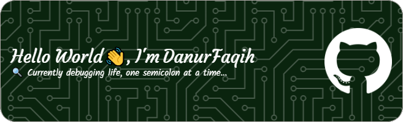

  

###

  
  

###

  

###

  

###

<h3 align="left">👩‍💻  About Me</h3>

###

I’m Danur Faqih, an Informatics Student from Indonesia who loves turning ideas into interfaces.   Sometimes I fix bugs. Other times, I just rename variables and hope it works.   Currently learning how to balance front-end dev, IoT projects, and enough sleep.

###

<h3 align="left">🛠 Language and tools</h3>

###

  
  
  
  
  
  
  
  
  
  
  
  
  
  
  

###

<h3 align="left">🔥   My Stats :</h3>

###

  

###

###

<!-- 
## Hi there I'm Danur Faqih 👋

<!--
**dnrfaqh/dnrfaqh** is a ✨ _special_ ✨ repository because its `README.md` (this file) appears on your GitHub profile.

Here are some ideas to get you started:

- 🔭 I’m currently working on ...
- 🌱 I’m currently learning ...
- 👯 I’m looking to collaborate on ...
- 🤔 I’m looking for help with ...
- 💬 Ask me about ...
- 📫 How to reach me: ...
- 😄 Pronouns: ...
- ⚡ Fun fact: ...
-->
<!-- ### ⚙️ Tech Toolbox

### 📫 Let's Connect
 --> -->
